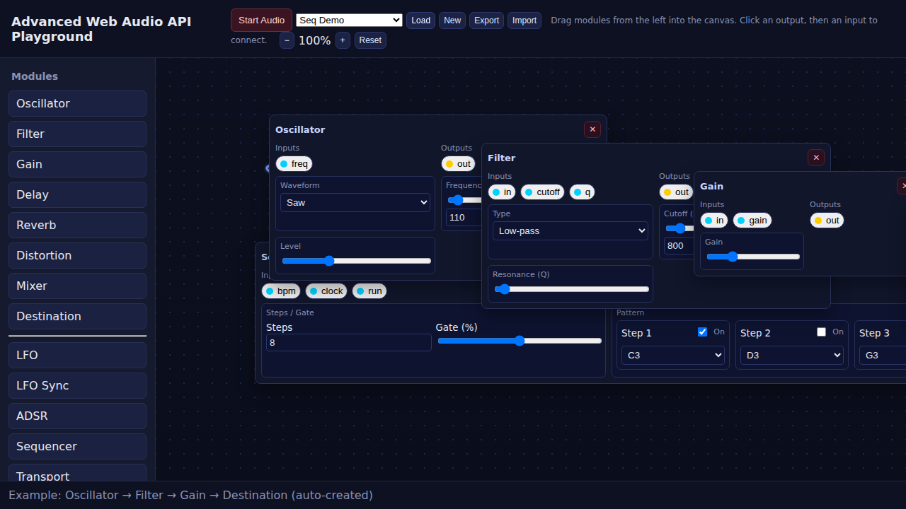

# Advanced Web Audio API Playground

[](https://opensource.org/licenses/MIT)
[](https://developer.mozilla.org/en-US/docs/Web/API/Web_Audio_API)
[](https://developer.mozilla.org/en-US/docs/Web/JavaScript)

A professional-grade modular audio synthesis playground built entirely with vanilla HTML/CSS/JavaScript and the Web Audio API. Create complex audio patches by dragging modules onto an intuitive canvas and connecting them with virtual cables, just like hardware modular synthesizers.



## Table of Contents

- [Features](#features)
- [Quick Start](#quick-start)
- [Installation](#installation)
- [Usage Guide](#usage-guide)
- [Available Modules](#available-modules)
- [Built-in Presets](#built-in-presets)
- [User Interface](#user-interface)
- [Development](#development)
- [Technical Notes](#technical-notes)
- [Contributing](#contributing)
- [License](#license)

## Features

🎵 **Professional Audio Engine**
- **Real Web Audio connections**: Visual cables map directly to `.connect()` and `.disconnect()` calls
- **Zero-latency processing**: Optimized for real-time audio synthesis and effects
- **Parameter automation**: CV control for almost every parameter

🖱️ **Intuitive Interface**
- **Drag-and-drop workflow**: Intuitive module patching on a zoomable canvas
- **Advanced canvas controls**: Zoom (40%-200%), pan, and smart cable management
- **Professional UX**: Multiple cable deletion methods, module resizing, compact modes

🔧 **Extensible Architecture**
- **Modular design**: Easy-to-extend base `Module` class for custom audio processors
- **16 built-in presets**: Ready-to-use patches from simple oscillators to complex sequences
- **Import/Export system**: Save and share your creations

## Quick Start

### Try It Now
🚀 **Live Demo** - Clone and run locally with any static server! (See [Installation](#installation) section)

### Basic Workflow
1. **🎛️ Add modules**: Drag from the left palette into the workspace
2. **🔌 Make connections**: Click output port (yellow) → input port (cyan)
3. **⚙️ Adjust parameters**: Real-time control with sliders and knobs
4. **🎵 Load presets**: Explore examples from the dropdown menu

## Installation

This project requires only a static web server to serve ES6 modules. No build process or dependencies needed!

### Prerequisites
- Modern web browser with Web Audio API support (Chrome, Firefox, Safari, Edge)
- Static web server (any of the options below)

### Local Development

**Option 1: Python (Recommended)**
```bash
# Clone the repository
git clone https://github.com/davvoz/Advanced-Web-Audio-API-Playground.git
cd Advanced-Web-Audio-API-Playground

# Start server
python3 -m http.server 5173
```

**Option 2: Node.js**
```bash
# Install and run http-server
npx http-server -p 5173 -c-1
```

**Option 3: PHP**
```bash
php -S localhost:5173
```

**Option 4: VS Code Live Server**
- Install "Live Server" extension
- Right-click `index.html` → "Open with Live Server"

### Getting Started
1. Open http://localhost:5173 in your browser
2. Click **"Start Audio"** to initialize the Web Audio context
3. Start creating! Try loading a preset from the dropdown to get familiar with the interface

## Usage Guide

### Create Your First Patch

**🎹 Simple Synthesis Chain**
```
Oscillator → Filter → Gain → Destination
```
1. Drag these modules onto the canvas in order
2. Connect them sequentially: `Oscillator.out` → `Filter.in` → `Gain.in` → `Destination.in`
3. Experiment with:
   - Oscillator frequency and waveform
   - Filter cutoff and resonance
   - Gain level

**🎵 Sequenced Pattern**
```
Transport → Sequencer → Oscillator → Gain → Destination
```
1. Add Transport and Sequencer modules
2. Connect timing: `Transport.clock` → `Sequencer.clock`, `Transport.bpm` → `Sequencer.bpm`
3. Connect control: `Sequencer.pitch` → `Oscillator.freq`, `Sequencer.gate` → `Gain.gain`
4. Program your pattern in the Sequencer grid
5. Click **"Start"** on the Transport module

**🎧 Sampler Usage**
```
Transport → Sequencer → Sampler → Effects → Destination
```
1. Drag or upload audio file to Sampler module
2. Set "Root MIDI" to match the sample's original pitch
3. Connect `Sequencer.pitch` → `Sampler.pitch` for melodic playback
4. Choose between One-shot (trigger) or Gate (sustain) modes

## Available Modules

### 🎛️ Audio Sources & Processing
| Module | Description | Key Features |
|--------|-------------|--------------|
| **Oscillator** | Waveform generators | Sine, square, sawtooth, triangle waves |
| **Filter** | Audio filtering | 8 filter types, cutoff & Q control |
| **Gain** | Signal amplification | CV-controllable gain staging |
| **Delay** | Echo effects | Time and feedback controls |
| **Reverb** | Convolution reverb | High-quality spatial effects |
| **Distortion** | Waveshaping | Multiple saturation curves |
| **Mixer** | Multi-channel mixing | Level, pan, mute per channel |
| **Destination** | Audio output | Master volume to speakers |

### 🌊 Modulation & Envelopes  
| Module | Description | Key Features |
|--------|-------------|--------------|
| **LFO** | Low-frequency oscillator | Multiple waveforms, rate control |
| **LFO Sync** | Tempo-synchronized LFO | Musical rates (1/16, 1/8, 1/4, etc.) |
| **ADSR** | Envelope generator | Attack, Decay, Sustain, Release |

### 🎵 Sequencing & Timing
| Module | Description | Key Features |
|--------|-------------|--------------|
| **Transport** | Global clock source | BPM control, start/stop |
| **Sequencer** | Pattern sequencer | 8-step grid, pitch & gate outputs |

### 🎧 Sampling
| Module | Description | Key Features |
|--------|-------------|--------------|
| **Sampler** | Audio file playback | Pitch tracking, looping, envelope |

## Built-in Presets

Explore these carefully crafted examples to learn different synthesis and sequencing techniques:

### 🎹 Basic Synthesis
- **Simple Bass** - Fundamental bass synthesis
- **Vibrato Pad** - Lush pad with vibrato modulation  
- **Tremolo** - Amplitude modulation effects
- **Auto Wah** - Filter modulation techniques
- **Pluck** - Sharp attack envelope shaping
- **Echo Space** - Delay and reverb combinations
- **Wobble Bass** - LFO filter modulation

### 🎵 Sequencer Patterns
- **Seq Demo** - Basic sequencer introduction
- **Seq Bassline** - Classic bassline patterns
- **Seq Arp Minor** - Arpeggiated sequences in minor
- **Seq Techno 16th** - 16th-note techno patterns
- **Seq Staccato** - Short, detached note sequences
- **Seq Octaves** - Octave-jumping patterns

### 🎛️ Advanced Patches  
- **Seq Transport Sync** - Complex timing demonstrations
- **ADSR Sequence Pad** - Envelope-controlled pad sequences
- **ADSR Volume Lead** - Dynamic lead synthesis

## User Interface

### 🖱️ Canvas Controls
| Action | Method | Description |
|--------|---------|-------------|
| **Zoom** | Mouse wheel / Buttons | 40%-200% zoom range |
| **Pan** | Drag empty areas | Scroll around large patches |
| **Module positioning** | Drag modules | Free positioning, cables auto-update |

### 🔌 Cable Management  
| Action | Method | Result |
|--------|---------|--------|
| **Create connection** | Click output → input | Visual cable created |
| **Delete connection** | Double-click cable | Cable removed |
| **Delete connection** | Click red deletion dot | Cable removed |
| **Replace connection** | Connect new cable to input | Old connection replaced |

> **💡 Pro Tip**: Each input accepts only one connection, but outputs can connect to multiple inputs

### ⚙️ Module Features
- **📏 Resizing**: Mixer module supports corner-handle resizing for better workflow
- **📦 Compact modes**: Mixer offers configurable columns and parameter visibility
- **🎛️ CV Control**: Most parameters accept control voltage from other modules
- **💾 State management**: Modules remember their settings in presets

## Development

### 🔧 Adding Custom Modules

The modular architecture makes it easy to extend functionality. Here's how to create a custom module:

**1. Create the Module Class**
```javascript
import { Module } from './module.js';

export class MyCustomModule extends Module {
  get title() { return 'My Custom Module'; }
  
  buildAudio() {
    // Create Web Audio nodes
    const gainNode = this.audioCtx.createGain();
    const filterNode = this.audioCtx.createBiquadFilter();
    
    // Chain audio nodes
    filterNode.connect(gainNode);
    
    // Define module inputs and outputs  
    this.inputs = { 
      in: { node: filterNode },
      cutoff: { param: filterNode.frequency }
    };
    this.outputs = { 
      out: { node: gainNode } 
    };
  }
  
  buildControls(container) {
    // Create UI controls
    const cutoffControl = document.createElement('div');
    cutoffControl.className = 'control';
    cutoffControl.innerHTML = `
      <label>Cutoff Frequency</label>
      <input type="range" min="20" max="20000" value="1000" />
    `;
    
    const slider = cutoffControl.querySelector('input');
    slider.addEventListener('input', () => {
      this.inputs.cutoff.param.setTargetAtTime(
        Number(slider.value), 
        this.audioCtx.currentTime, 
        0.01
      );
    });
    
    container.appendChild(cutoffControl);
  }
}
```

**2. Register Your Module**
```javascript
// In modules/index.js
import { MyCustomModule } from './mycustommodule.js';

export const ModuleRegistry = {
  // ... existing modules
  'MyCustomModule': MyCustomModule,
};
```

### 📁 Project Structure
```
📦 Advanced-Web-Audio-API-Playground/
├── 📄 index.html              # Main application layout
├── 🎨 style.css              # UI styles and theming  
├── ⚙️ main.js                # Canvas, connections, presets
├── 📸 screenshot.png         # Documentation image
└── 📂 modules/
    ├── 📄 index.js           # Module registry
    ├── 🔧 module.js          # Base Module class
    ├── 🎵 oscillator.js      # Waveform generators
    ├── 🎛️ filter.js          # Audio filtering  
    ├── 📢 gain.js            # Amplification
    ├── 🔄 delay.js           # Echo effects
    ├── 🌊 reverb.js          # Convolution reverb
    ├── ⚡ distortion.js      # Waveshaping
    ├── 🎚️ mixer.js          # Multi-channel mixing
    ├── 🔊 destination.js     # Audio output
    ├── 〰️ lfo.js            # Modulation sources
    ├── ⏰ lfosync.js         # Tempo-synced modulation
    ├── 📈 adsr.js           # Envelope generators
    ├── 🎹 sequencer.js       # Pattern sequencing
    ├── ⏱️ transport.js       # Global timing
    └── 🎧 sampler.js         # Audio file playback
```

### 🚀 Development Tips
- **Hot Reload**: Use a development server with live reload for faster iteration
- **Browser DevTools**: Web Audio API calls are visible in the Console
- **Module Testing**: Test modules individually before integration
- **Performance**: Monitor CPU usage in large patches

## Technical Notes

### 🌐 Browser Compatibility
- **Supported Browsers**: Chrome 66+, Firefox 61+, Safari 14+, Edge 79+
- **Web Audio API**: Full support required for all features
- **ES6 Modules**: Native module support needed (no transpilation)

### ⚡ Performance Characteristics
- **Real-time Processing**: Optimized for low-latency audio processing
- **Memory Management**: Automatic cleanup of disconnected modules
- **CPU Usage**: Scales with patch complexity and active modules
- **Audio Buffer Size**: Defaults to browser optimal settings

### 🔧 Audio Architecture
| Concept | Implementation | Notes |
|---------|---------------|-------|
| **Audio Context** | Single shared context | User gesture required to start |
| **Connection Model** | One-to-many outputs, one-to-one inputs | Prevents feedback loops |
| **Parameter Automation** | AudioParam connections | CV control for modulation |
| **File Support** | Web Audio buffer loading | WAV, MP3, OGG, M4A formats |

### 🎛️ Advanced Features
- **Modular CV System**: Connect any output to compatible parameter inputs
- **Preset Management**: JSON-based patch saving and loading  
- **Visual Feedback**: Real-time parameter updates and connection states
- **Responsive Design**: Adapts to different screen sizes and zoom levels

## Contributing

We welcome contributions from the audio programming community! Here's how you can help:

### 🐛 Bug Reports
- Check existing issues before creating new ones
- Provide clear reproduction steps
- Include browser and OS information
- Test with different audio hardware if possible

### ✨ Feature Requests  
- Describe the musical/technical use case
- Consider backward compatibility
- Propose UI/UX improvements where relevant

### 🔧 Code Contributions
1. **Fork** the repository
2. **Create** a feature branch (`git checkout -b feature/amazing-filter`)
3. **Write** clean, documented code following existing patterns
4. **Test** your changes across different browsers
5. **Submit** a pull request with clear description

### 📝 Documentation
- Improve existing documentation
- Add examples for complex features  
- Create tutorials for specific techniques
- Translate to other languages

### 🎵 Preset Contributions
- Create interesting musical examples
- Document the synthesis techniques used
- Ensure presets work across different browsers

## License

MIT License - Feel free to use, modify, and distribute.

See [LICENSE](LICENSE) for full details.

---

**🎵 Built with passion for audio programming and modular synthesis**

*If this project helped you create something amazing, we'd love to hear about it! Share your creations and feedback.*
